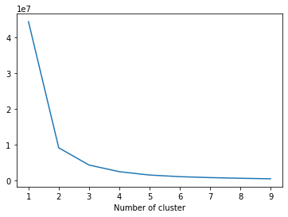
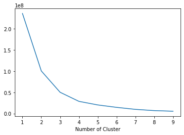
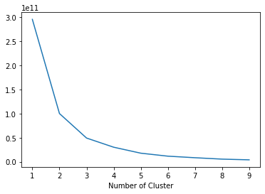
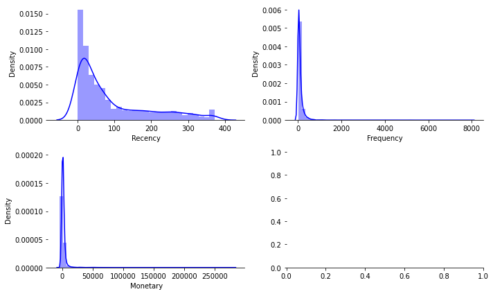
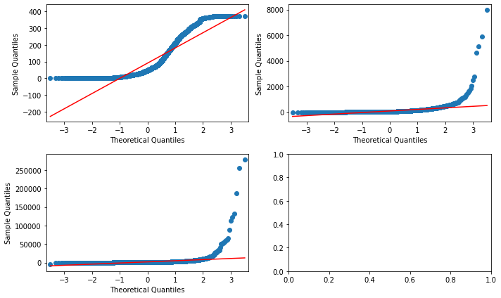

# RFM
데이터셋 출처 : http://archive.ics.uci.edu/ml/datasets/Online+Retail
```python
import pandas as pd
from matplotlib import pyplot as plt
import seaborn as sns

import warnings
warnings.filterwarnings(action='ignore')
```

# Load data


```python
df = pd.read_excel('data/Online Retail.xlsx')
df.head()
```


<div>
<table border="1" class="dataframe">
  <thead>
    <tr style="text-align: right;">
      <th></th>
      <th>InvoiceNo</th>
      <th>StockCode</th>
      <th>Description</th>
      <th>Quantity</th>
      <th>InvoiceDate</th>
      <th>UnitPrice</th>
      <th>CustomerID</th>
      <th>Country</th>
    </tr>
  </thead>
  <tbody>
    <tr>
      <th>0</th>
      <td>536365</td>
      <td>85123A</td>
      <td>WHITE HANGING HEART T-LIGHT HOLDER</td>
      <td>6</td>
      <td>2010-12-01 08:26:00</td>
      <td>2.55</td>
      <td>17850.0</td>
      <td>United Kingdom</td>
    </tr>
    <tr>
      <th>1</th>
      <td>536365</td>
      <td>71053</td>
      <td>WHITE METAL LANTERN</td>
      <td>6</td>
      <td>2010-12-01 08:26:00</td>
      <td>3.39</td>
      <td>17850.0</td>
      <td>United Kingdom</td>
    </tr>
    <tr>
      <th>2</th>
      <td>536365</td>
      <td>84406B</td>
      <td>CREAM CUPID HEARTS COAT HANGER</td>
      <td>8</td>
      <td>2010-12-01 08:26:00</td>
      <td>2.75</td>
      <td>17850.0</td>
      <td>United Kingdom</td>
    </tr>
    <tr>
      <th>3</th>
      <td>536365</td>
      <td>84029G</td>
      <td>KNITTED UNION FLAG HOT WATER BOTTLE</td>
      <td>6</td>
      <td>2010-12-01 08:26:00</td>
      <td>3.39</td>
      <td>17850.0</td>
      <td>United Kingdom</td>
    </tr>
    <tr>
      <th>4</th>
      <td>536365</td>
      <td>84029E</td>
      <td>RED WOOLLY HOTTIE WHITE HEART.</td>
      <td>6</td>
      <td>2010-12-01 08:26:00</td>
      <td>3.39</td>
      <td>17850.0</td>
      <td>United Kingdom</td>
    </tr>
  </tbody>
</table>
</div>


```python
# 송장 날짜 필드 유형 -> datetime 
df['InvoiceDate']= pd.to_datetime(df['InvoiceDate'])

# 연도 필드 생성
df['InvoiveYearMonth'] = df['InvoiceDate'].map(lambda date: 100*date.year + date.month)


# 각 행에 대한 통화 계산 
df['Monetary'] = df['UnitPrice'] * df['Quantity']

# YearMonth - Monetary 열을 활용해 새 데이터프레임 생성
monetary = df.groupby(['InvoiveYearMonth'])['Monetary'].sum().reset_index()

```


```python
monetary
```


<div>
<table border="1" class="dataframe">
  <thead>
    <tr style="text-align: right;">
      <th></th>
      <th>InvoiveYearMonth</th>
      <th>Monetary</th>
    </tr>
  </thead>
  <tbody>
    <tr>
      <th>0</th>
      <td>201012</td>
      <td>748957.020</td>
    </tr>
    <tr>
      <th>1</th>
      <td>201101</td>
      <td>560000.260</td>
    </tr>
    <tr>
      <th>2</th>
      <td>201102</td>
      <td>498062.650</td>
    </tr>
    <tr>
      <th>3</th>
      <td>201103</td>
      <td>683267.080</td>
    </tr>
    <tr>
      <th>4</th>
      <td>201104</td>
      <td>493207.121</td>
    </tr>
    <tr>
      <th>5</th>
      <td>201105</td>
      <td>723333.510</td>
    </tr>
    <tr>
      <th>6</th>
      <td>201106</td>
      <td>691123.120</td>
    </tr>
    <tr>
      <th>7</th>
      <td>201107</td>
      <td>681300.111</td>
    </tr>
    <tr>
      <th>8</th>
      <td>201108</td>
      <td>682680.510</td>
    </tr>
    <tr>
      <th>9</th>
      <td>201109</td>
      <td>1019687.622</td>
    </tr>
    <tr>
      <th>10</th>
      <td>201110</td>
      <td>1070704.670</td>
    </tr>
    <tr>
      <th>11</th>
      <td>201111</td>
      <td>1461756.250</td>
    </tr>
    <tr>
      <th>12</th>
      <td>201112</td>
      <td>433668.010</td>
    </tr>
  </tbody>
</table>
</div>


# 고객세분화
1. 낮은 가치 : 다른 사람들보다 덜 활동적이고 구매자/방문 빈도가 매우 낮고 매우 낮은(0) 수익을 창출하는 고객
2. 중간 가치 : 상당히 빈번하고 중간 정도의 수익을 창출하는 고객
3. 높은 가치 : 높은 수익, 빈도 및 낮은 비활성 고객 -> 기업은 항상 이러한 고객을 유지하기 원함

## 최신성(Recency)
- 각 고객의 가장 최근 구매 날짜를 찾아 며칠동안 비활성 상태인지 확인
- 각 고객의 비활성 일수에 대해 **K-means** 클러스터링을 적용하여 고객에게 최근성 점수 할당


```python
# user DF 만들기
# user ID를 unique하게 
user = pd.DataFrame(df['CustomerID'].unique())
user.columns = ['CustomerID']

# 가장 최신 거래일자(InvoiceDate.max) 가져오기
max_purchase = df.groupby('CustomerID').InvoiceDate.max().reset_index()
max_purchase.columns=['CustomerID', 'MaxPurchaseDate']

# 최신성 계산
max_purchase['Recency'] = (max_purchase['MaxPurchaseDate'].max() - max_purchase['MaxPurchaseDate']).dt.days
max_purchase

# user df와 max_purchase df merge
user = pd.merge(user, max_purchase[['CustomerID', 'Recency']], on='CustomerID')
user.head()

```


<div>
<table border="1" class="dataframe">
  <thead>
    <tr style="text-align: right;">
      <th></th>
      <th>CustomerID</th>
      <th>Recency</th>
    </tr>
  </thead>
  <tbody>
    <tr>
      <th>0</th>
      <td>17850.0</td>
      <td>301</td>
    </tr>
    <tr>
      <th>1</th>
      <td>13047.0</td>
      <td>31</td>
    </tr>
    <tr>
      <th>2</th>
      <td>12583.0</td>
      <td>2</td>
    </tr>
    <tr>
      <th>3</th>
      <td>13748.0</td>
      <td>95</td>
    </tr>
    <tr>
      <th>4</th>
      <td>15100.0</td>
      <td>329</td>
    </tr>
  </tbody>
</table>
</div>


```python
from sklearn.cluster import KMeans
from tqdm import tqdm
```


```python
sse = {}
recency = user[['Recency']]

for k in tqdm(range(1, 10)):
    kmeans = KMeans(n_clusters=k, max_iter=1000).fit(recency)
    recency['clusters'] = kmeans.labels_
    sse[k] = kmeans.inertia_
```

    100%|██████████| 9/9 [00:00<00:00, 12.31it/s]


```python
plt.figure()
plt.plot(list(sse.keys()), list(sse.values()))
plt.xlabel('Number of cluster')
plt.show()
```


    

    


- 그래프상으로는 3개의 클러스터
- 비즈니스 요구 사항에 따라 더 적거나 더 많은 클러스터 사용 가능 -> 이 예시 : 4개 사용


```python
# recency 로 4개의 클러스터를 만들고 user df에 추가
kmeans = KMeans(n_clusters=4)
kmeans.fit(user[['Recency']])
user['RecencyCluster'] = kmeans.predict(user[['Recency']])
```


```python
# cluster numbers로 정렬하는 함수
def order_cluster(cluster_field_name, target_field_name, data, ascending):
    
    new_cluster_field_name = 'new_'+cluster_field_name
    data_new = data.groupby(cluster_field_name)[target_field_name].mean().reset_index()
    data_new = data_new.sort_values(by=target_field_name, ascending=ascending).reset_index(drop=True)
    
    data_new['index'] = data_new.index
    
    data_final = pd.merge(data, data_new[[cluster_field_name, 'index']], on=cluster_field_name)
    data_final = data_final.drop([cluster_field_name], axis=1)
    data_final = data_final.rename(columns={'index':cluster_field_name})
    
    return data_final
```


```python
user.head()
```


<div>
<table border="1" class="dataframe">
  <thead>
    <tr style="text-align: right;">
      <th></th>
      <th>CustomerID</th>
      <th>Recency</th>
      <th>RecencyCluster</th>
    </tr>
  </thead>
  <tbody>
    <tr>
      <th>0</th>
      <td>17850.0</td>
      <td>301</td>
      <td>2</td>
    </tr>
    <tr>
      <th>1</th>
      <td>13047.0</td>
      <td>31</td>
      <td>3</td>
    </tr>
    <tr>
      <th>2</th>
      <td>12583.0</td>
      <td>2</td>
      <td>3</td>
    </tr>
    <tr>
      <th>3</th>
      <td>13748.0</td>
      <td>95</td>
      <td>1</td>
    </tr>
    <tr>
      <th>4</th>
      <td>15100.0</td>
      <td>329</td>
      <td>2</td>
    </tr>
  </tbody>
</table>
</div>


```python

user.head()
```


<div>
<table border="1" class="dataframe">
  <thead>
    <tr style="text-align: right;">
      <th></th>
      <th>CustomerID</th>
      <th>Recency</th>
      <th>RecencyCluster</th>
    </tr>
  </thead>
  <tbody>
    <tr>
      <th>0</th>
      <td>17850.0</td>
      <td>301</td>
      <td>3</td>
    </tr>
    <tr>
      <th>1</th>
      <td>15100.0</td>
      <td>329</td>
      <td>3</td>
    </tr>
    <tr>
      <th>2</th>
      <td>18074.0</td>
      <td>373</td>
      <td>3</td>
    </tr>
    <tr>
      <th>3</th>
      <td>16250.0</td>
      <td>260</td>
      <td>3</td>
    </tr>
    <tr>
      <th>4</th>
      <td>13747.0</td>
      <td>373</td>
      <td>3</td>
    </tr>
  </tbody>
</table>
</div>


```python
max(user.Recency)
```


    373


```python
user.groupby('RecencyCluster')['Recency'].describe()
```


<div>
<table border="1" class="dataframe">
  <thead>
    <tr style="text-align: right;">
      <th></th>
      <th>count</th>
      <th>mean</th>
      <th>std</th>
      <th>min</th>
      <th>25%</th>
      <th>50%</th>
      <th>75%</th>
      <th>max</th>
    </tr>
    <tr>
      <th>RecencyCluster</th>
      <th></th>
      <th></th>
      <th></th>
      <th></th>
      <th></th>
      <th></th>
      <th></th>
      <th></th>
    </tr>
  </thead>
  <tbody>
    <tr>
      <th>0</th>
      <td>2167.0</td>
      <td>17.538533</td>
      <td>13.320860</td>
      <td>0.0</td>
      <td>6.0</td>
      <td>16.0</td>
      <td>28.00</td>
      <td>48.0</td>
    </tr>
    <tr>
      <th>1</th>
      <td>1072.0</td>
      <td>79.278918</td>
      <td>23.875838</td>
      <td>49.0</td>
      <td>59.0</td>
      <td>73.0</td>
      <td>95.00</td>
      <td>134.0</td>
    </tr>
    <tr>
      <th>2</th>
      <td>627.0</td>
      <td>189.451356</td>
      <td>32.948533</td>
      <td>135.0</td>
      <td>161.0</td>
      <td>187.0</td>
      <td>217.00</td>
      <td>249.0</td>
    </tr>
    <tr>
      <th>3</th>
      <td>506.0</td>
      <td>308.851779</td>
      <td>39.144563</td>
      <td>250.0</td>
      <td>274.0</td>
      <td>305.0</td>
      <td>350.75</td>
      <td>373.0</td>
    </tr>
  </tbody>
</table>
</div>


# Frequency


```python
user_freq = df.groupby('CustomerID').InvoiceNo.count().reset_index()
user_freq.columns = ['CustomerID', 'Frequency']
user = pd.merge(user, user_freq, on='CustomerID')
user
```


<div>
<table border="1" class="dataframe">
  <thead>
    <tr style="text-align: right;">
      <th></th>
      <th>CustomerID</th>
      <th>Recency</th>
      <th>RecencyCluster</th>
      <th>Frequency</th>
    </tr>
  </thead>
  <tbody>
    <tr>
      <th>0</th>
      <td>17850.0</td>
      <td>301</td>
      <td>3</td>
      <td>312</td>
    </tr>
    <tr>
      <th>1</th>
      <td>15100.0</td>
      <td>329</td>
      <td>3</td>
      <td>6</td>
    </tr>
    <tr>
      <th>2</th>
      <td>18074.0</td>
      <td>373</td>
      <td>3</td>
      <td>13</td>
    </tr>
    <tr>
      <th>3</th>
      <td>16250.0</td>
      <td>260</td>
      <td>3</td>
      <td>24</td>
    </tr>
    <tr>
      <th>4</th>
      <td>13747.0</td>
      <td>373</td>
      <td>3</td>
      <td>1</td>
    </tr>
    <tr>
      <th>...</th>
      <td>...</td>
      <td>...</td>
      <td>...</td>
      <td>...</td>
    </tr>
    <tr>
      <th>4367</th>
      <td>13296.0</td>
      <td>136</td>
      <td>2</td>
      <td>5</td>
    </tr>
    <tr>
      <th>4368</th>
      <td>17693.0</td>
      <td>135</td>
      <td>2</td>
      <td>18</td>
    </tr>
    <tr>
      <th>4369</th>
      <td>15372.0</td>
      <td>136</td>
      <td>2</td>
      <td>27</td>
    </tr>
    <tr>
      <th>4370</th>
      <td>13194.0</td>
      <td>135</td>
      <td>2</td>
      <td>3</td>
    </tr>
    <tr>
      <th>4371</th>
      <td>16447.0</td>
      <td>135</td>
      <td>2</td>
      <td>36</td>
    </tr>
  </tbody>
</table>
<p>4372 rows × 4 columns</p>
</div>


```python
user.Frequency.isna().sum()
```


    0


```python
sse = {}
freq = user_freq[['Frequency']]

for k in range(1, 10):
    kmeans = KMeans(n_clusters=k, max_iter=1000).fit(freq)
    freq['clusters'] = kmeans.labels_
    sse[k] = kmeans.inertia_
    
plt.figure()
plt.plot(list(sse.keys()), list(sse.values()))
plt.xlabel("Number of Cluster")
plt.show()
```


    

    


```python
# cluster_num : 4
kmeans = KMeans(n_clusters=4)
kmeans.fit(user[['Frequency']])
user['FreqCluster'] = kmeans.predict(user[['Frequency']])
user.head()
```


<div>
<table border="1" class="dataframe">
  <thead>
    <tr style="text-align: right;">
      <th></th>
      <th>CustomerID</th>
      <th>Recency</th>
      <th>RecencyCluster</th>
      <th>Frequency</th>
      <th>FreqCluster</th>
    </tr>
  </thead>
  <tbody>
    <tr>
      <th>0</th>
      <td>17850.0</td>
      <td>301</td>
      <td>3</td>
      <td>312</td>
      <td>2</td>
    </tr>
    <tr>
      <th>1</th>
      <td>15100.0</td>
      <td>329</td>
      <td>3</td>
      <td>6</td>
      <td>0</td>
    </tr>
    <tr>
      <th>2</th>
      <td>18074.0</td>
      <td>373</td>
      <td>3</td>
      <td>13</td>
      <td>0</td>
    </tr>
    <tr>
      <th>3</th>
      <td>16250.0</td>
      <td>260</td>
      <td>3</td>
      <td>24</td>
      <td>0</td>
    </tr>
    <tr>
      <th>4</th>
      <td>13747.0</td>
      <td>373</td>
      <td>3</td>
      <td>1</td>
      <td>0</td>
    </tr>
  </tbody>
</table>
</div>


```python
max(user_freq['Frequency'])
```


    7983


```python
user = order_cluster('FreqCluster', 'Frequency', user, True)
user
```


<div>
<table border="1" class="dataframe">
  <thead>
    <tr style="text-align: right;">
      <th></th>
      <th>CustomerID</th>
      <th>Recency</th>
      <th>RecencyCluster</th>
      <th>Frequency</th>
      <th>FreqCluster</th>
    </tr>
  </thead>
  <tbody>
    <tr>
      <th>0</th>
      <td>17850.0</td>
      <td>301</td>
      <td>3</td>
      <td>312</td>
      <td>1</td>
    </tr>
    <tr>
      <th>1</th>
      <td>15808.0</td>
      <td>305</td>
      <td>3</td>
      <td>210</td>
      <td>1</td>
    </tr>
    <tr>
      <th>2</th>
      <td>13047.0</td>
      <td>31</td>
      <td>0</td>
      <td>196</td>
      <td>1</td>
    </tr>
    <tr>
      <th>3</th>
      <td>12583.0</td>
      <td>2</td>
      <td>0</td>
      <td>251</td>
      <td>1</td>
    </tr>
    <tr>
      <th>4</th>
      <td>14688.0</td>
      <td>7</td>
      <td>0</td>
      <td>359</td>
      <td>1</td>
    </tr>
    <tr>
      <th>...</th>
      <td>...</td>
      <td>...</td>
      <td>...</td>
      <td>...</td>
      <td>...</td>
    </tr>
    <tr>
      <th>4367</th>
      <td>14456.0</td>
      <td>4</td>
      <td>0</td>
      <td>977</td>
      <td>2</td>
    </tr>
    <tr>
      <th>4368</th>
      <td>12748.0</td>
      <td>0</td>
      <td>0</td>
      <td>4642</td>
      <td>3</td>
    </tr>
    <tr>
      <th>4369</th>
      <td>14911.0</td>
      <td>0</td>
      <td>0</td>
      <td>5903</td>
      <td>3</td>
    </tr>
    <tr>
      <th>4370</th>
      <td>17841.0</td>
      <td>1</td>
      <td>0</td>
      <td>7983</td>
      <td>3</td>
    </tr>
    <tr>
      <th>4371</th>
      <td>14096.0</td>
      <td>3</td>
      <td>0</td>
      <td>5128</td>
      <td>3</td>
    </tr>
  </tbody>
</table>
<p>4372 rows × 5 columns</p>
</div>


# Monetary


```python
user_mon = df.groupby('CustomerID').Monetary.sum().reset_index()
user_mon.columns = ['CustomerID', 'Monetary']
user = pd.merge(user, user_mon, how='left', on='CustomerID')
user
```


<div>
<table border="1" class="dataframe">
  <thead>
    <tr style="text-align: right;">
      <th></th>
      <th>CustomerID</th>
      <th>Recency</th>
      <th>RecencyCluster</th>
      <th>Frequency</th>
      <th>FreqCluster</th>
      <th>Monetary</th>
    </tr>
  </thead>
  <tbody>
    <tr>
      <th>0</th>
      <td>17850.0</td>
      <td>301</td>
      <td>3</td>
      <td>312</td>
      <td>1</td>
      <td>5288.63</td>
    </tr>
    <tr>
      <th>1</th>
      <td>15808.0</td>
      <td>305</td>
      <td>3</td>
      <td>210</td>
      <td>1</td>
      <td>3724.77</td>
    </tr>
    <tr>
      <th>2</th>
      <td>13047.0</td>
      <td>31</td>
      <td>0</td>
      <td>196</td>
      <td>1</td>
      <td>3079.10</td>
    </tr>
    <tr>
      <th>3</th>
      <td>12583.0</td>
      <td>2</td>
      <td>0</td>
      <td>251</td>
      <td>1</td>
      <td>7187.34</td>
    </tr>
    <tr>
      <th>4</th>
      <td>14688.0</td>
      <td>7</td>
      <td>0</td>
      <td>359</td>
      <td>1</td>
      <td>5107.38</td>
    </tr>
    <tr>
      <th>...</th>
      <td>...</td>
      <td>...</td>
      <td>...</td>
      <td>...</td>
      <td>...</td>
      <td>...</td>
    </tr>
    <tr>
      <th>4367</th>
      <td>14456.0</td>
      <td>4</td>
      <td>0</td>
      <td>977</td>
      <td>2</td>
      <td>3047.63</td>
    </tr>
    <tr>
      <th>4368</th>
      <td>12748.0</td>
      <td>0</td>
      <td>0</td>
      <td>4642</td>
      <td>3</td>
      <td>29072.10</td>
    </tr>
    <tr>
      <th>4369</th>
      <td>14911.0</td>
      <td>0</td>
      <td>0</td>
      <td>5903</td>
      <td>3</td>
      <td>132572.62</td>
    </tr>
    <tr>
      <th>4370</th>
      <td>17841.0</td>
      <td>1</td>
      <td>0</td>
      <td>7983</td>
      <td>3</td>
      <td>40340.78</td>
    </tr>
    <tr>
      <th>4371</th>
      <td>14096.0</td>
      <td>3</td>
      <td>0</td>
      <td>5128</td>
      <td>3</td>
      <td>57120.91</td>
    </tr>
  </tbody>
</table>
<p>4372 rows × 6 columns</p>
</div>


```python
user.Monetary.isna().sum()
```


    0


```python
sse = {}
mone = user_mon[['Monetary']]

for k in range(1, 10):
    kmeans = KMeans(n_clusters=k, max_iter=1000).fit(mone)
    mone['clusters'] = kmeans.labels_
    sse[k] = kmeans.inertia_
    
plt.figure()
plt.plot(list(sse.keys()), list(sse.values()))
plt.xlabel("Number of Cluster")
plt.show()
```


    

    


```python
# cluster_num : 4
kmeans = KMeans(n_clusters=4)
kmeans.fit(user[['Monetary']])
user['MoneCluster'] = kmeans.predict(user[['Monetary']])
user.head()
```


<div>
<table border="1" class="dataframe">
  <thead>
    <tr style="text-align: right;">
      <th></th>
      <th>CustomerID</th>
      <th>Recency</th>
      <th>RecencyCluster</th>
      <th>Frequency</th>
      <th>FreqCluster</th>
      <th>Monetary</th>
      <th>MoneCluster</th>
    </tr>
  </thead>
  <tbody>
    <tr>
      <th>0</th>
      <td>17850.0</td>
      <td>301</td>
      <td>3</td>
      <td>312</td>
      <td>1</td>
      <td>5288.63</td>
      <td>0</td>
    </tr>
    <tr>
      <th>1</th>
      <td>15808.0</td>
      <td>305</td>
      <td>3</td>
      <td>210</td>
      <td>1</td>
      <td>3724.77</td>
      <td>0</td>
    </tr>
    <tr>
      <th>2</th>
      <td>13047.0</td>
      <td>31</td>
      <td>0</td>
      <td>196</td>
      <td>1</td>
      <td>3079.10</td>
      <td>0</td>
    </tr>
    <tr>
      <th>3</th>
      <td>12583.0</td>
      <td>2</td>
      <td>0</td>
      <td>251</td>
      <td>1</td>
      <td>7187.34</td>
      <td>0</td>
    </tr>
    <tr>
      <th>4</th>
      <td>14688.0</td>
      <td>7</td>
      <td>0</td>
      <td>359</td>
      <td>1</td>
      <td>5107.38</td>
      <td>0</td>
    </tr>
  </tbody>
</table>
</div>


```python
max(user['Monetary'])
```


    279489.0199999999


```python
user = order_cluster('MoneCluster', 'Monetary', user, True)
user
```


<div>
<table border="1" class="dataframe">
  <thead>
    <tr style="text-align: right;">
      <th></th>
      <th>CustomerID</th>
      <th>Recency</th>
      <th>RecencyCluster</th>
      <th>Frequency</th>
      <th>FreqCluster</th>
      <th>Monetary</th>
      <th>MoneCluster</th>
    </tr>
  </thead>
  <tbody>
    <tr>
      <th>0</th>
      <td>17850.0</td>
      <td>301</td>
      <td>3</td>
      <td>312</td>
      <td>1</td>
      <td>5288.63</td>
      <td>0</td>
    </tr>
    <tr>
      <th>1</th>
      <td>15808.0</td>
      <td>305</td>
      <td>3</td>
      <td>210</td>
      <td>1</td>
      <td>3724.77</td>
      <td>0</td>
    </tr>
    <tr>
      <th>2</th>
      <td>13047.0</td>
      <td>31</td>
      <td>0</td>
      <td>196</td>
      <td>1</td>
      <td>3079.10</td>
      <td>0</td>
    </tr>
    <tr>
      <th>3</th>
      <td>12583.0</td>
      <td>2</td>
      <td>0</td>
      <td>251</td>
      <td>1</td>
      <td>7187.34</td>
      <td>0</td>
    </tr>
    <tr>
      <th>4</th>
      <td>14688.0</td>
      <td>7</td>
      <td>0</td>
      <td>359</td>
      <td>1</td>
      <td>5107.38</td>
      <td>0</td>
    </tr>
    <tr>
      <th>...</th>
      <td>...</td>
      <td>...</td>
      <td>...</td>
      <td>...</td>
      <td>...</td>
      <td>...</td>
      <td>...</td>
    </tr>
    <tr>
      <th>4367</th>
      <td>12748.0</td>
      <td>0</td>
      <td>0</td>
      <td>4642</td>
      <td>3</td>
      <td>29072.10</td>
      <td>1</td>
    </tr>
    <tr>
      <th>4368</th>
      <td>17841.0</td>
      <td>1</td>
      <td>0</td>
      <td>7983</td>
      <td>3</td>
      <td>40340.78</td>
      <td>1</td>
    </tr>
    <tr>
      <th>4369</th>
      <td>17450.0</td>
      <td>7</td>
      <td>0</td>
      <td>351</td>
      <td>1</td>
      <td>187482.17</td>
      <td>3</td>
    </tr>
    <tr>
      <th>4370</th>
      <td>18102.0</td>
      <td>0</td>
      <td>0</td>
      <td>433</td>
      <td>1</td>
      <td>256438.49</td>
      <td>3</td>
    </tr>
    <tr>
      <th>4371</th>
      <td>14646.0</td>
      <td>1</td>
      <td>0</td>
      <td>2085</td>
      <td>2</td>
      <td>279489.02</td>
      <td>3</td>
    </tr>
  </tbody>
</table>
<p>4372 rows × 7 columns</p>
</div>


# Overall 점수 계산


```python
user['OverallScore'] = user['RecencyCluster'] + user['FreqCluster'] + user['MoneCluster']
user.head(2)
```


<div>
<table border="1" class="dataframe">
  <thead>
    <tr style="text-align: right;">
      <th></th>
      <th>CustomerID</th>
      <th>Recency</th>
      <th>RecencyCluster</th>
      <th>Frequency</th>
      <th>FreqCluster</th>
      <th>Monetary</th>
      <th>MoneCluster</th>
      <th>OverallScore</th>
    </tr>
  </thead>
  <tbody>
    <tr>
      <th>0</th>
      <td>17850.0</td>
      <td>301</td>
      <td>3</td>
      <td>312</td>
      <td>1</td>
      <td>5288.63</td>
      <td>0</td>
      <td>4</td>
    </tr>
    <tr>
      <th>1</th>
      <td>15808.0</td>
      <td>305</td>
      <td>3</td>
      <td>210</td>
      <td>1</td>
      <td>3724.77</td>
      <td>0</td>
      <td>4</td>
    </tr>
  </tbody>
</table>
</div>


```python
user.groupby('OverallScore')['Recency', 'Frequency', 'Monetary'].mean()
```

    <ipython-input-28-df6b25c73e47>:1: FutureWarning: Indexing with multiple keys (implicitly converted to a tuple of keys) will be deprecated, use a list instead.
      user.groupby('OverallScore')['Recency', 'Frequency', 'Monetary'].mean()


<div>
<table border="1" class="dataframe">
  <thead>
    <tr style="text-align: right;">
      <th></th>
      <th>Recency</th>
      <th>Frequency</th>
      <th>Monetary</th>
    </tr>
    <tr>
      <th>OverallScore</th>
      <th></th>
      <th></th>
      <th></th>
    </tr>
  </thead>
  <tbody>
    <tr>
      <th>0</th>
      <td>19.207885</td>
      <td>66.073477</td>
      <td>1190.082838</td>
    </tr>
    <tr>
      <th>1</th>
      <td>61.545004</td>
      <td>115.058824</td>
      <td>1824.852170</td>
    </tr>
    <tr>
      <th>2</th>
      <td>162.491957</td>
      <td>95.404826</td>
      <td>2194.031597</td>
    </tr>
    <tr>
      <th>3</th>
      <td>298.376426</td>
      <td>51.332700</td>
      <td>1383.659734</td>
    </tr>
    <tr>
      <th>4</th>
      <td>74.583333</td>
      <td>1882.083333</td>
      <td>74938.799167</td>
    </tr>
    <tr>
      <th>5</th>
      <td>1.333333</td>
      <td>4372.000000</td>
      <td>156394.183333</td>
    </tr>
  </tbody>
</table>
</div>


# 고객 가치 나누기
- 0-2: 낮음
- 2-4: 가치 있음
- 5+ : 높은 가치


```python
user['Segment'] = 'Low-Value'
user.loc[user['OverallScore'] >2, 'Segment'] = 'Mid-Value'
user.loc[user['OverallScore'] >4, 'Segment'] = 'High-Value'
user.head()
```


<div>
<table border="1" class="dataframe">
  <thead>
    <tr style="text-align: right;">
      <th></th>
      <th>CustomerID</th>
      <th>Recency</th>
      <th>RecencyCluster</th>
      <th>Frequency</th>
      <th>FreqCluster</th>
      <th>Monetary</th>
      <th>MoneCluster</th>
      <th>OverallScore</th>
      <th>Segment</th>
    </tr>
  </thead>
  <tbody>
    <tr>
      <th>0</th>
      <td>17850.0</td>
      <td>301</td>
      <td>3</td>
      <td>312</td>
      <td>1</td>
      <td>5288.63</td>
      <td>0</td>
      <td>4</td>
      <td>Mid-Value</td>
    </tr>
    <tr>
      <th>1</th>
      <td>15808.0</td>
      <td>305</td>
      <td>3</td>
      <td>210</td>
      <td>1</td>
      <td>3724.77</td>
      <td>0</td>
      <td>4</td>
      <td>Mid-Value</td>
    </tr>
    <tr>
      <th>2</th>
      <td>13047.0</td>
      <td>31</td>
      <td>0</td>
      <td>196</td>
      <td>1</td>
      <td>3079.10</td>
      <td>0</td>
      <td>1</td>
      <td>Low-Value</td>
    </tr>
    <tr>
      <th>3</th>
      <td>12583.0</td>
      <td>2</td>
      <td>0</td>
      <td>251</td>
      <td>1</td>
      <td>7187.34</td>
      <td>0</td>
      <td>1</td>
      <td>Low-Value</td>
    </tr>
    <tr>
      <th>4</th>
      <td>14688.0</td>
      <td>7</td>
      <td>0</td>
      <td>359</td>
      <td>1</td>
      <td>5107.38</td>
      <td>0</td>
      <td>1</td>
      <td>Low-Value</td>
    </tr>
  </tbody>
</table>
</div>


```python
user[['Recency', 'Frequency', 'Monetary']].describe()
```


<div>
<table border="1" class="dataframe">
  <thead>
    <tr style="text-align: right;">
      <th></th>
      <th>Recency</th>
      <th>Frequency</th>
      <th>Monetary</th>
    </tr>
  </thead>
  <tbody>
    <tr>
      <th>count</th>
      <td>4372.000000</td>
      <td>4372.000000</td>
      <td>4372.000000</td>
    </tr>
    <tr>
      <th>mean</th>
      <td>91.047118</td>
      <td>93.053294</td>
      <td>1898.459701</td>
    </tr>
    <tr>
      <th>std</th>
      <td>100.765435</td>
      <td>232.471608</td>
      <td>8219.345141</td>
    </tr>
    <tr>
      <th>min</th>
      <td>0.000000</td>
      <td>1.000000</td>
      <td>-4287.630000</td>
    </tr>
    <tr>
      <th>25%</th>
      <td>16.000000</td>
      <td>17.000000</td>
      <td>293.362500</td>
    </tr>
    <tr>
      <th>50%</th>
      <td>49.000000</td>
      <td>42.000000</td>
      <td>648.075000</td>
    </tr>
    <tr>
      <th>75%</th>
      <td>142.000000</td>
      <td>102.000000</td>
      <td>1611.725000</td>
    </tr>
    <tr>
      <th>max</th>
      <td>373.000000</td>
      <td>7983.000000</td>
      <td>279489.020000</td>
    </tr>
  </tbody>
</table>
</div>


- Recency 평균은 91, 중앙값 49 
- Monetary 음수 : 환불


```python
f, axes = plt.subplots(2, 2, figsize=(10, 6))
sns.despine(left=True)

# 데이터 그리기
sns.distplot(user.Recency, color='b', ax=axes[0,0])
sns.distplot(user.Frequency, color='b', ax=axes[0,1])
sns.distplot(user.Monetary, color='b', ax=axes[1,0])

plt.tight_layout()
```


    

    


```python
from statsmodels.graphics.gofplots import qqplot

f, axes = plt.subplots(2, 2, figsize=(10, 6))

qqplot(user.Recency, line='r', ax=axes[0,0], label='Recency')
qqplot(user.Frequency, line='r', ax=axes[0,1], label='Frequency')
qqplot(user.Monetary, line='r', ax=axes[1,0], label='Monetary')

plt.tight_layout()
```


    

    


##### Q-Q Plot
- 정규화를 검토하기 위한 그래프
- 직선: 정규분포값, 점선 : 실제 데이터의 값
- 점선과 직선이 일치할수록, 데이터는 정규분포를 따름

##### 데이터
- 검정통계량, 분포, QQ-plot -> "데이터가 정규분포를 따르지 않는다"
- 따라서 예측을 위해 **비모수적 프레임워크**를 사용하는 것이 좋음

## 고객 세분화 전략
- 고가치 고객 : 유지율 향상
- 중간가치 고객 : 유지율향상 및 빈도 증가
- 저가치 고객 : 빈도 증가

# 고객평생가치(CLTV)

1) 3, 6, 12, 24개월 중 원하는 기간을 선택<br>
2) 총 수익 - 총 비용 방정식을 사용해 해당 기간 특정 기간의 각 고객에 대한 CLTV 계산

##### CLTV 예측 과정
1. CLTV 계산을 위한 적절한 시간 프레임 정의
2. 미래를 예측하고 생성하는데 사용할 기능 식별
3. ML 모델 학습을 위한 CLTV 계산
4. ML 모델 빌드 및 실행
5. 모델이 유용한지 확인


```python
from datetime import datetime
```


```python
# 각 고객 ID에 대한 RFM 점수 얻음
# 데이터 세트 분할 - 3개월 데이터로 RFM 계산 -> 다음 6개월 데이터로 예측

# 3m 및 6m 데이터 프레임 생성
m3 = df[(df.InvoiceDate < datetime(2011,6,1)) & (df.InvoiceDate >= datetime(2011,3,1)) ].reset_index(drop=True)
m6 = df[(df.InvoiceDate >= datetime(2011, 6, 1)) & (df.InvoiceDate < datetime(2011, 12,1))].reset_index(drop=True)
```


```python
len(df), len(m3), len(m6)
```


    (541909, 103694, 307355)


```python
# 최신성(Recency) 계산 함수
def Recency(input_df, user_df):
    max_purchase = input_df.groupby('CustomerID').InvoiceDate.max().reset_index()
    max_purchase.columns=['CustomerID', 'MaxPurchaseDate']

    # 최신성 계산
    max_purchase['Recency'] = (max_purchase['MaxPurchaseDate'].max() - max_purchase['MaxPurchaseDate']).dt.days

    # user df와 max_purchase df merge
    user_df = pd.merge(user_df, max_purchase[['CustomerID', 'Recency']], on='CustomerID')
    
    # recency 로 4개의 클러스터를 만들고 user df에 추가
    kmeans = KMeans(n_clusters=4)
    kmeans.fit(user_df[['Recency']])
    user_df['RecencyCluster'] = kmeans.predict(user_df[['Recency']])
    
    user_df = order_cluster('RecencyCluster', 'Recency', user_df, True)
    
    return user_df

```
